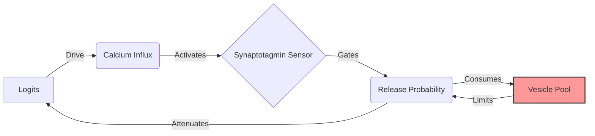
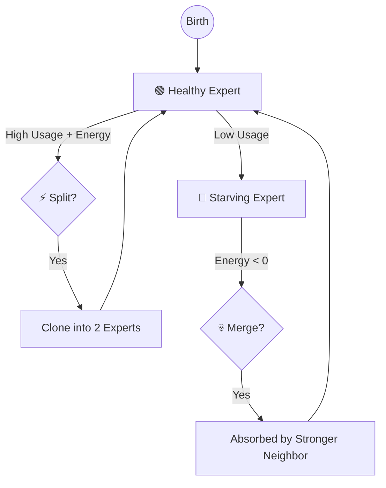

# Bio-Inspired Nanochat

> **"What if a Transformer had a metabolism?"**

[](https://www.python.org/downloads/)
[](https://pytorch.org/)
[](./LICENSE)

This is a research fork of [Nanochat](https://github.com/karpathy/nanochat) that replaces standard static weights with **computational analogs of synaptic proteins**, implementing biologically-grounded mechanisms for working memory, attention modulation, and neural architecture search.

Standard LLMs are "frozen crystals"—static matrices of `float16` numbers that never change once training is done. **Bio-Inspired Nanochat** is a "living fluid". Its connections grow, shrink, fatigue, recover, and even reproduce *during inference*, mimicking the energy-constrained efficiency of the biological brain.

## 📊 Project Status

This is an **active research project** implementing 11+ bio-inspired mechanisms with systematic evaluation and optimization. See our comprehensive planning documents:

- 📋 [**Full Roadmap**](.beads/) - 69 tasks across 7 epics (Beads tracker)
- 🧬 [**CMA-ES Optimization Plan**](PLAN_TO_USE_CMAES_FOR_HYPERPARAMETER_EXPLORATION_AND_OPTIMIZATION_ACROSS_ALL_BIO_INSPIRED_FEATURES.md) - Systematic hyperparameter tuning (10 params wired in Phase 1; ~48 planned across two phases)
- 🎯 [**Feature Predictions**](CLAUDE_SONNET45_PREDICTIONS_ON_WHICH_NEW_BIO_INSPIRED_IDEAS_WILL_WORK_BEST_OR_NOT.md) - Evidence-based analysis of which mechanisms will work
- 🚀 [**New Features Roadmap**](NEW_RADICALLY_NEW_BIO_INSPIRED_FEATURES_TO_ADD_IN_MODULAR_WAY.md) - Detailed specs for upcoming mechanisms

**Implementation Status:**
Status legend: ✅ shipping (on the live model path, tested) · 🚧 partial/landing · 🔮 aspirational (roadmap).

- ✅ **Core Synaptic Mechanisms** — presynaptic release (faithful Hill dynamics), online Hebbian fast-weights, and the structural MoE lifecycle all run on the live path.
- ✅ **Stochastic release · BDNF metaplasticity · dual fast/slow weights** — implemented and toggleable.
- 🚧 **Triton GPU & Rust CPU kernels** — both exist as landing targets that must match the golden reference (`tests/test_presyn_golden.py`), but the live path is pure PyTorch (`release_canonical`); kernel dispatch is not yet wired (`jyb.*`).
- 🚧 **Systematic Optimization** — CMA-ES Phase 1 (the 10 most influential params) is wired; the broader ~48-param two-phase search is planned.
- 🚧 **Rigorous Evaluation** — the statistical layer (paired t / Wilcoxon, bootstrap + Student-t 95% CIs, multi-seed aggregation) ships in `bio_inspired_nanochat/eval_stats.py`; the full benchmark-matrix *run* is still pending.

---

## ⚔️ Tale of the Tape: Silicon vs. Carbon

| Feature | Standard Transformer | Bio-Inspired Nanochat |
| :--- | :--- | :--- |
| **Weights** | 🧊 **Static**: Fixed after training. | 🌊 **Fluid**: Evolve in real-time during inference. |
| **Memory** | 📜 **Context Window**: Limited by `seq_len`. | 🧠 **Associative**: Fast-weights "remember" patterns locally. |
| **Diversity** | 🎲 **Randomness**: Temperature sampling. | 🔋 **Metabolism**: Synapses "tire out", forcing new paths. |
| **Capacity** | 🏗️ **Fixed**: Pre-allocated size (e.g., 32 layers). | 🏙️ **Elastic**: Experts multiply/die based on demand. |
| **Learning** | 🏫 **Offline**: Only learns during Backprop. | ⚡ **Online**: "Learns" context via Hebbian consolidation. |
| **Optimization** | 🎯 **Grid Search**: Manual hyperparameter tuning. | 🧬 **Evolution**: CMA-ES tunes the bio parameters (10 wired in Phase 1). |
| **Kernels** | 🐍 **Python/CUDA**: Single backend. | ⚡ **Reference + landing kernels**: pure-PyTorch live path; Triton GPU + Rust CPU kernels golden-tested. |

---

## 🧠 The "Wetware" Stack: From Biology to Math

We map specific cellular mechanisms from the [Synaptic Cleft](https://en.wikipedia.org/wiki/Chemical_synapse) directly to tensor operations. This architecture is grounded in neuroscience literature and the blueprints found in `prompts/`.

### 1. Presynaptic Biophysics (The Sender)
*The mechanism of "Fatigue" and "Boredom"*

**The Biology**: Neurons run on batteries (ATP). If a neuron shouts too much (fires continuously), it runs out of neurotransmitter vesicles (chemical ammo). It *must* rest to reload.

**The Math**: We track a fluid reservoir `RRP` (Readily Releasable Pool) for every attention head. High attention scores drain the pool.

**The Effect**: A physically-grounded **frequency penalty**. The model literally *cannot* attend to the same token endlessly. It gets "bored" (depleted) and naturally shifts focus to novel information.

**Implementation**: the live model path is `SynapticPresyn.release_canonical` (pure PyTorch, differentiable, golden-locked in `tests/test_presyn_golden.py`). Two kernel backends exist as landing targets that must match that golden, but are **not yet on the live dispatch path** (`jyb.*`):
- **Triton GPU Kernel** (`bio_inspired_nanochat/kernels/presyn_fused.py`): 375-line fused kernel.
- **Rust CPU Kernel** (`rust_src/src/presyn.rs`): PyO3-native implementation.


```mermaid
graph LR
    A[Logits] -->|Drive| B(Calcium Influx)
    B -->|Activates| C{Synaptotagmin Sensor}
    D[Vesicle Pool] -->|Limits| E(Release Probability)
    C -->|Gates| E
    E -->|Attenuates| A
    E -->|Consumes| D
    style D fill:#ff9999,stroke:#333,stroke-width:2px
```

### 2. Postsynaptic Density (The Receiver)
*The mechanism of "Working Memory"*

**The Biology**: "Neurons that fire together, wire together." A transient thought becomes a memory only if it is important (high activity) and the brain has energy to "write" it down (Consolidation).

**The Math**: Weights are split into $W_{slow}$ (Long-term) and $W_{fast}$ (Short-term).
$$ y = x(W_{slow} + \underbrace{W_{fast} + \text{Hebb}(x, y)}_{\text{The Scratchpad}}) $$

**The Effect**: **Infinite local context**. The model can define a variable at the start of a sentence and "remember" it at the end via the fast weights, without needing to attend back to it.

**Mechanisms**:
- ✅ **BDNF Metaplasticity**: activity-dependent learning-rate modulation — implemented and toggleable (`bdnf_gamma`).
- ✅ **Dual-Weight Differentiation**: separate fast-cache vs slow-storage timescales (`W_fast` / `W_slow`).
- ✅ **CaMKII/PP1 Bistable Latch** (opt-in via `bistable_latch`, `sax.2`): a Lisman-style switch — CaMKII autophosphorylation (Hill self-excitation) + mutual cross-inhibition with PP1 over a basal phosphatase floor — with PP1 folded into the consolidation gate. Gives genuine **hysteresis**: a supra-threshold pulse latches the synapse ON and it *stays* after the input drops; sustained LTD flips it OFF (tested in `tests/test_bistable_latch.py`). Default-off keeps the legacy CaMKII threshold gate.

### 3. Structural Plasticity (The Life Cycle)
*The mechanism of "Economy & Efficiency"*

**The Biology**: The brain is a ruthlessly efficient economy. It doesn't keep billions of idle neurons on payroll. Useful regions get more resources (Neurogenesis); idle regions are demolished (Pruning).

**The Math**: A **Synaptic Mixture-of-Experts (MoE)** with a per-expert **energy metabolism** and a **health-based lifecycle** (health = utilization × energy). The "bank-account" framing below is a metaphor for these real mechanisms (there is no literal accounting/`bankruptcy`/`IPO` code):
*   **Energy cost** ("taxation"): firing draws down an expert's energy (`energy_use`); idling lets it refill (`energy_fill`).
*   **Utilization** ("income"): being routed raises utilization, which feeds the health score.
*   **Merge** ("bankruptcy"): persistently low-health experts are merged into stronger neighbors.
*   **Split** ("IPO"): high-health experts clone into weak slots.

These events are **function-preserving** (Net2Net / firefly, `sm_function_preserving=1`, default on): a split makes the destination an exact clone of the parent and gives both a `-ln2` routing-logit bias, so the twins jointly reproduce the parent's routing mass (each fires with half the gate) while antisymmetric `fc1` noise lets them diverge under SGD. In the **dense** regime (`top_k == num_experts`) the model output is unchanged at the event; in sparse top-k the discontinuity is sharply reduced (≈10–40× gentler than the legacy noisy clone in tests) but not zero, since moving a twin pair across the top-k boundary is inherently discrete. Set `sm_function_preserving=0` for the legacy noisy-clone behavior.

When `use_neuroscore` is enabled, NeuroScore fitness (below) is blended into that health signal so credit assignment — not just utilization × energy — drives these decisions.

**The Effect**: **Neural Architecture Search**. The model starts small and *grows* capacity exactly where the data complexity demands it.


```mermaid
graph TD
    Start((Birth)) --> Healthy[🟢 Healthy Expert]
    Healthy -->|High Usage + Energy| Split{⚡ Split?}
    Split -->|Yes| Clones[Clone into 2 Experts]
    Healthy -->|Low Usage| Starving[🔴 Starving Expert]
    Starving -->|Energy < 0| Merge{💀 Merge?}
    Merge -->|Yes| Absorb[Absorbed by Stronger Neighbor]
    Clones --> Healthy
    Absorb --> Healthy
```

### 4. Neuromodulation (Global State)

*The mechanism of "Context-Dependent Gating"*

**The Biology**: Real plasticity is gated by a few **global neuromodulators** broadcast brain-wide. Dopamine (DA) signals reward-prediction error; acetylcholine (ACh) signals uncertainty/attention; norepinephrine (NE) signals arousal/novelty.

**The Math** (`hy8.1`, `NeuromodulatoryBus`, opt-in via `neuromod_enabled=1`): three scalars are computed each step from model signals (loss-improvement → DA, predictive entropy → ACh, loss-surprise → NE), EMA-smoothed, and **broadcast** as multiplicative gains onto every synapse:
*   **DA → plasticity gain**: scales the online Hebbian consolidation, so only reward-relevant / loss-reducing updates stick. This is the third factor that bridges Hebbian plasticity to RL (`hy8.2`).
*   **ACh → exploration & attention** (`hy8.5`): scales the stochastic vesicle-release fraction AND an input/attention gain — more uncertainty, more exploration and sharper input sensitivity; the model commits when confident.
*   **NE → global gain / reset**: scales the synaptic output and, on a surprising event, flushes the per-sequence working memory.

Default-neutral (gains 1.0) when off, so it's a no-op unless enabled; telemetry exposes all three levels and gains per step.

---

## 🚀 Advanced Bio-Inspired Features (Roadmap)

Beyond the core mechanisms, we're systematically implementing 11 additional biologically-grounded features:

### Ready for Implementation
1. **Stochastic Vesicle Release** - Binomial/Gumbel-Sigmoid stochastic path with STE for training
2. **Vesicle Endocytosis Ring Buffer** - Delayed refill with optional Rab5/7 staging
3. **Septin-Style Lateral Inhibition** - Windowed inhibition on logits/router for sharpening

### In Research Phase
4. **Rab/SNARE Code-Based Routing** - Token cargo codes vs expert t-SNARE compatibility
5. **Doc2 Dual Sync/Async Channels** - Parallel Syt1 (fast) and Doc2 (slow) release paths
6. **Synaptic Genome Embedding** - Low-dim Xi per expert decoded to kinetic parameters
7. **CaMKII/PP1 Bistable Latch** - Hill-term ODE with hysteresis for consolidation
8. **Cellular Automata Initialization** - Rule 30/116 variance-corrected weight init

**Synaptic Genome Embedding (Xi):** Each MoE expert owns a compact genome vector `Xi` (size `SynapticConfig.xi_dim`). A decoder maps `Xi → phenotype` scalars that control expert-specific kinetics (e.g., metabolism EMA rates and CaMKII/PP1 plasticity gains). This keeps per-expert learnable parameters at `O(num_experts · xi_dim)` rather than `O(num_experts · num_kinetics)` if every expert had its own full kinetic parameter set.

### Experimental
9. **Cross-Pollination with Gauge-Reversible Networks** - Integration of measure-preserving ideas
10. **Simplicial/Higher-Order Attention** - k-body interactions beyond pairwise
11. **Ultrametric Routing** - Hierarchical expert organization

Each feature is:
- 📝 **Documented** with biological rationale, implementation plan, and success criteria
- 🧪 **Testable** via ablation studies and statistical validation
- ⚙️ **Toggleable** via `SynapticConfig` flags, with a registry + validator (`bio_inspired_nanochat/ablation_registry.py`) that defines every mechanism's ablation knob and rejects silently-broken configs (e.g. an opt-in mechanism enabled without its prerequisite)
- 📊 **Benchmarked** against vanilla transformers with rigorous metrics

See [NEW_RADICALLY_NEW_BIO_INSPIRED_FEATURES_TO_ADD_IN_MODULAR_WAY.md](NEW_RADICALLY_NEW_BIO_INSPIRED_FEATURES_TO_ADD_IN_MODULAR_WAY.md) for detailed specifications.

---

## 🔬 Deep Dive: The Math of the Synapse

For the researchers, here are the governing equations implemented in `synaptic.py` and `neuroscore.py`.

> **These are the *live* equations.** As of the presyn unification (`8j9.2`), the model's
> attention path runs `SynapticPresyn.release_canonical`, which implements exactly the faithful
> dynamics below — closing the long-standing gap where these equations were documented but the
> live code used a cheaper sigmoid approximation.

### 1. Calcium Dynamics (The Integrator)
Calcium $C$ acts as a leaky integrator of the incoming attention signal (Logits $L$), coupled to a fast calcium **buffer** $B$ (a parvalbumin/calbindin analog that absorbs and re-releases calcium).

$$ C_{t} = e^{-1/\tau_c} \cdot C_{t-1} + \alpha_{ca} \cdot \text{softplus}(L_t) - \alpha_{on} C_{t-1}(1 - B_{t-1}) + \alpha_{off} B_{t-1} $$
$$ B_{t} = e^{-1/\tau_b} \cdot B_{t-1} + \alpha_{on} C_{t-1}(1 - B_{t-1}) - \alpha_{off} B_{t-1} $$

### 2. The Release Probability (The Gate)
The probability $P_{release}$ that a vesicle is actually released depends on the Calcium level (detected by Synaptotagmin) versus the clamp (Complexin).

$$ P_{release} = \sigma(3 \cdot \text{Syt}(C) + 2 \cdot P_{primed} - 2 \cdot \text{Complexin}) \cdot \sigma(\text{Logits}) $$

Where $\text{Syt}(C)$ is a Hill equation modeling the calcium sensor's sensitivity (Syt1 fast + Syt7 slow, plus a Doc2 facilitation term):
$$ \text{Syt}(C) = 0.7\frac{C}{C + K_{d,\text{fast}}} + 0.3\frac{C}{C + K_{d,\text{slow}}} + g_{\text{doc2}}\,\sigma(4(C - 0.12)) $$

### 3. Vesicle Release & Depletion (The Limiter)
The released amount is the release probability scaled by the available vesicles in the Readily Releasable Pool ($RRP$). Since $P_{release}\in[0,1]$, this is bounded by the pool ($R_t \le RRP_t$) — the faithful reading of $W_{eff}=\min(P,RRP)$.

$$ R_t = P_{release} \cdot RRP_t $$
$$ RRP_{t+1} = RRP_t - R_t + \text{RefillRate} $$

The released signal is then scaled by an energy-gated AMPA amplitude $q = \sigma(\beta_q (E - 0.5)) \cdot q_{max}$ and biased by a septin-like distance barrier. This non-linear depletion is what physically enforces the frequency penalty.

### 4. Hebbian Learning (Fast Weights + Gated Consolidation)
Low-rank eligibility traces $U, V$ accumulate co-activity each step. Fast weights decay and absorb the trace (the short-term scratchpad). Consolidation into the slow weights is gated by CaMKII and modulated by BDNF metaplasticity:

$$ \Delta W_{slow} = \eta_{slow}\,(1 + \gamma\,\text{BDNF})\,\overline{U V^{T}}\;\cdot\;\underbrace{\big(\sigma(\text{CaMKII} - 0.5) - 0.3\big)}_{\text{CaMKII threshold gate}} $$

The gate opens as CaMKII rises past its threshold. **By default** PP1 is tracked as the opposing "erase" signal but is not in the gate. Enabling `bistable_latch` (`sax.2`) switches the gate to the true bistable form $\sigma(\beta\,(\text{CaMKII}-\text{PP1}))$ and replaces the linear CaMKII update with a self-exciting Lisman switch (hysteresis; latched long-term retention robust to quiescence) — see the [Bistable Latch](#2-postsynaptic-density-the-receiver) mechanism above.

### 5. NeuroScore Dynamics (The Credit Assignment)
In `neuroscore.py`, we calculate the evolutionary fitness of each expert using three metrics:

*   **Efficiency**: Performance per unit of metabolic cost.
    $$ \text{Eff}_i = \frac{\text{Contribution}_i}{\text{Energy}_i + \epsilon} $$
*   **Specialization**: How unique is the expert's input distribution compared to the global average?
    $$ \text{Spec}_i = 1 - \cos(\mu_{expert}, \mu_{global}) $$
*   **Resilience**: Stability of the expert's contribution over time (inverse variance).
    $$ \text{Res}_i = \frac{1}{\text{Var}(\text{Contribution}_i) + \epsilon} $$

When `use_neuroscore` is enabled (default-off), these three metrics are combined into a per-expert fitness that is blended into the health signal driving Split / Merge / Reset (`de5l`). With it off, the lifecycle uses utilization × energy alone and NeuroScore is an observability metric.

---

## 🧬 Evolution in Silicon: Systematic Hyperparameter Optimization

Manually tuning dozens of interacting biological hyperparameters (time constants, enzyme affinities, energy costs) is intractable for humans. We employ **CMA-ES (Covariance Matrix Adaptation Evolution Strategy)** for systematic, derivative-free optimization. **Status:** Phase 1 (the 10 most influential params) is wired today; the broader subgroup design below — and the ~48-parameter figure — is the *plan*, not shipping code. `SynapticConfig` exposes 89 hyperparameters total (see [`docs/parameter_census.md`](docs/parameter_census.md)).

### The Challenge

Our parameter space includes:
- **10 Calcium Dynamics Parameters** (tau_c, alpha_ca, buffering rates, etc.)
- **12 Vesicle Trafficking Parameters** (RRP refill, priming, endocytosis rates)
- **8 Postsynaptic Plasticity Parameters** (Hebbian gains, CaMKII/PP1, BDNF)
- **6 Structural Plasticity Parameters** (energy costs, split/merge thresholds)
- **12 Rust Kernel Compatibility Parameters** (tau_buf, tau_prime, etc.)

These parameters interact non-linearly across:
- Multiple timescales (ms to seconds)
- Competing objectives (quality vs performance)
- Stochastic dynamics (vesicle release noise)

### Two-Phase CMA-ES Strategy

**Phase 1: Critical Parameters (10D, ~$500)**
Focus on the top-10 most influential parameters identified via sensitivity analysis:
- `tau_rrp_log` - Vesicle refill timescale
- `lambda_loge` - Eligibility trace decay
- `camkii_up_log` - LTP strength
- `pp1_up_log` - LTD strength
- `energy_cost_rel_log` - Metabolic taxation
- (Plus 5 more... see full plan)

**Phase 2: Subgroup Searches (38D staged, ~$2000)**
With Phase 1 winners fixed, optimize subgroups in parallel:
- **Calcium Group** (8 params): Buffering, sensor kinetics
- **Vesicle Group** (9 params): Priming, endocytosis, SNARE
- **Postsynaptic Group** (7 params): Hebbian, BDNF, CaMKII/PP1
- **Structural Group** (8 params): Energy, health, routing
- **Kernel Compat Group** (6 params): Rust-specific parameters

**Objective Function:**
Multi-objective composite balancing:
- **Quality** (70%): Perplexity, NIAH accuracy, calibration (ECE)
- **Performance** (30%): Tokens/sec, memory efficiency

See [PLAN_TO_USE_CMAES_FOR_HYPERPARAMETER_EXPLORATION_AND_OPTIMIZATION_ACROSS_ALL_BIO_INSPIRED_FEATURES.md](PLAN_TO_USE_CMAES_FOR_HYPERPARAMETER_EXPLORATION_AND_OPTIMIZATION_ACROSS_ALL_BIO_INSPIRED_FEATURES.md) for the complete 15,000-word plan including:
- Detailed parameter inventory with biological justification
- Search space design and encoding strategies
- Fast proxy objective with learning-curve extrapolation
- Distributed evaluation harness design
- Budget tracking and go/no-go checkpoints
- Risk mitigation and sensitivity analysis

### Quick Start with CMA-ES

```bash
# (Recommended) Sanity gate before expensive runs
uv run python -m scripts.tune_bio_params sanity --seed 1 --device cpu

# Phase 1: Optimize top-10 parameters (10D)
uv run python -m scripts.tune_bio_params optimize \
  --seed 1337 --device cuda --generations 50 --popsize 10 \
  --run-dir runs/cmaes/top10

# Resume from the latest checkpoint
uv run python -m scripts.tune_bio_params optimize --run-dir runs/cmaes/top10 --resume

# Stagnation / early-stop policy (defaults: 20 gens, <1% improvement, action=stop)
uv run python -m scripts.tune_bio_params optimize \
  --run-dir runs/cmaes/top10 --stagnation-action sigma_reset
```

This will:
- ✅ Support `torchrun --distributed` for multi-GPU population eval (rank0 controller)
- ✅ Save `progress.jsonl`, `best_params.json`, and `es_latest.pkl` (+ per-gen checkpoints) under `--run-dir`
- ✅ Log scalars/histograms/covariance heatmap to TensorBoard under `--run-dir/tb/`

---

## ⚡ High-Performance Multi-Backend Architecture

Bio-Inspired Nanochat targets **dual RTX 4090** training/inference. The live presynaptic path is pure PyTorch today; two native kernels exist as landing targets that must match the golden reference (`tests/test_presyn_golden.py`) before they go live (`jyb.*`).

### Kernel Backends

1. **Python reference / live path** ✅
   - `SynapticPresyn.release_canonical` — the differentiable, golden-locked dynamics the model actually runs.

2. **Triton GPU Kernel** 🚧 (landing — not yet dispatched on the live path)
   - Location: `bio_inspired_nanochat/kernels/presyn_fused.py`
   - 375-line fused presynaptic dynamics kernel
   - Written against the reference `forward()`; must be re-targeted to the canonical top-k path (`jyb.2`).

3. **Rust CPU Kernel** 🚧 (landing — not yet dispatched on the live path)
   - Location: `rust_src/src/presyn.rs`, `rust_src/src/moe.rs`
   - PyO3-based native extensions; build requires `maturin develop`.

### Performance Optimizations (In Progress)

Our dual-4090 optimization roadmap includes:
- 🚧 **FlexAttention/FlashAttention Evaluation** - Compare SDPA vs FlexAttention vs FlashAttn2/3
- 🚧 **NCCL/P2P Tuning** - Optimize DDP for PCIe (no NVLink) with bucket sizes and grad overlap
- 🚧 **Memory Optimizations** - bf16, activation checkpointing, torch.compile modes
- 🚧 **Triton Kernel Fusion** - Reduce 3-pass to single-pass attention
- 🚧 **Inference Fastpath** - KV cache reuse + cudagraphs for steady-state decode
- 🚧 **CI Performance Guardrails** - Automated regression testing

Target: **90%+ GPU utilization** on dual 4090s for both training and inference.

---

## 📊 Rigorous Evaluation Framework

We're implementing systematic bio vs vanilla evaluation with statistical rigor:

- **Benchmark matrix design**: `docs/eval_benchmark_matrix.md`
- **Standardized run harness**: `python -m scripts.eval_matrix --help`

### Benchmark Matrix

**Quality Metrics:**
- **Perplexity** - Validation loss on FineWeb-Edu
- **Long-Context** - Needle-in-a-Haystack (NIAH) retrieval accuracy, swept over length × needle depth (implemented: `synthetic_tasks.niah_accuracy_by_length`, wired into `eval_matrix` as `niah_acc`; sweep to 4k/8k for large models)
- **Calibration** - Expected Calibration Error (ECE)
- **MoE Health** - Expert specialization (Gini), dead expert fraction
- **Memory** - Associative recall on synthetic tasks

**Performance Metrics:**
- **Training** - Tokens/sec, GPU utilization, peak memory
- **Inference** - Latency (prompt + decode), throughput, KV cache efficiency

### Experimental Design

- **Configs**: Vanilla GPT, bio-all, per-feature toggles (11 ablations)
- **Seeds**: 2-3 seeds per config for statistical significance
- **Tests**: paired t-test + Wilcoxon signed-rank, bootstrap & Student-t 95% CIs, direction-aware multi-seed aggregation — implemented in `bio_inspired_nanochat/eval_stats.py` (run `python -m bio_inspired_nanochat.eval_stats <summary.csv>` on an `eval_matrix` output)
- **Budget**: Fixed token budget per run (~10B tokens for small-scale)

### Reproducibility

All benchmarks are:
- ✅ **Deterministic** - Fixed seeds, documented NCCL/CUDA flags
- ✅ **Scripted** - Single command to run full matrix
- ✅ **Logged** - JSONL/CSV output with run metadata
- ✅ **Versioned** - Checkpoint/config stored with results

Example:
```bash
# Run CORE benchmark evaluation
uv run scripts/base_eval.py
```

If the eval bundle download fails (e.g. HTTP 403), point the script at a local bundle or a mirror:
```bash
uv run python -m scripts.base_eval --eval-bundle-zip /path/to/eval_bundle.zip
# or
uv run python -m scripts.base_eval --eval-bundle-dir /path/to/eval_bundle/
```

See our evaluation roadmap in `.beads/` (Epic: `bio_inspired_nanochat-gzm`).

---

## 🔬 Biological Parameter Reference

Every aspect of the synapse can be tuned via `SynapticConfig`. These parameters act as the "genome" of the artificial brain.

### Presynaptic (The "Sender")
| Parameter | Default | Bio-Analog | Effect on Model |
| :--- | :--- | :--- | :--- |
| `tau_c` | 4.0 | **Calcium Decay** | How long a neuron stays "excited" after firing. Higher = longer bursts. |
| `tau_rrp` | 40.0 | **Vesicle Refill** | Recovery time from fatigue. Higher = prone to "writer's block" if repetitive. |
| `alpha_ca` | 0.25 | **Calcium Influx** | Sensitivity to attention scores. Higher = easier to trigger release. |
| `syt_fast_kd` | 0.4 | **Synaptotagmin $K_d$** | The threshold for rapid release. Lower = more trigger-happy. |
| `stochastic_train_frac`| 0.12 | **Thermal Noise** | Fraction of query positions that use stochastic vesicle release during training. |
| `stochastic_mode`| `normal_reparam` | **Sampler** | Fast stochastic sampling mode (`normal_reparam`, `gumbel_sigmoid_ste`, or `straight_through`). |
| `stochastic_tau`| 1.0 | **Temperature** | Relaxation temperature for `gumbel_sigmoid_ste` (lower = harder). |
| `stochastic_count_cap`| 8 | **Count Cap** | Max vesicles per edge for stochastic sampling (higher = more compute). |
| `tau_buf` | 4.0 | **Calcium Buffer** | Buffering timescale. Higher = slower calcium dynamics. |
| `tau_prime` | 5.0 | **SNARE Priming** | Vesicle priming timescale. Affects release readiness. |

### Postsynaptic (The "Receiver")
| Parameter | Default | Bio-Analog | Effect on Model |
| :--- | :--- | :--- | :--- |
| `rank_eligibility` | 16 | **PSD Complexity** | Rank of the Hebbian update. Higher = more complex associative patterns. |
| `rho_elig` | 0.95 | **Trace Decay** | How long the "scratchpad" memory lasts. 0.95 $\approx$ 20 tokens halflife. |
| `camkii_gain` | 1.5 | **LTP Strength** | "Write" speed for long-term memory. Higher = learns faster from context. |
| `pp1_gain` | 1.0 | **LTD Strength** | "Erase" speed. Higher = forgets useless context faster. |
| `bdnf_gamma` | 0.0 | **Metaplasticity** | BDNF-driven LR modulation. Higher = activity-dependent learning boost. |

### Structural (The "City Planner")
| Parameter | Default | Bio-Analog | Effect on Model |
| :--- | :--- | :--- | :--- |
| `energy_cost_rel` | 0.015 | **Metabolic Cost** | The tax paid for firing. Higher = leaner, smaller networks. |
| `split_health_min` | 0.80 | **Mitosis Threshold** | How healthy an expert must be to clone. Lower = faster growth. |
| `router_contrastive_push`| 0.1 | **Lateral Inhibition**| Forces experts to specialize. Higher = sharper specialization. |

**Parameter counts** (machine-verified — see [`docs/parameter_census.md`](docs/parameter_census.md), regenerated by `scripts/param_census.py`):
- **89** `SynapticConfig` hyperparameters, every one read by runtime code (the 6 dead fields were pruned in `8j9.5`; the bistable-latch mechanism `sax.2` added 12 live, default-off knobs; the differentiable-recurrence wiring `hwxb.4.6` added 3 live, default-off knobs — `differentiable_recurrence`, `recurrence_block_size`, `recurrence_chunk_len`). The count is machine-verified by `scripts/param_census.py`; the "48-parameter genome" figure was an early planning estimate, not a code count.
- **10** of those are actually wired into the CMA-ES search (`TOP10_PARAM_SPECS`, Phase 1). The 38-parameter "subgroup" phase is aspirational (see the CMA-ES plan), not shipping.
- The biological **genome** is the learned per-expert `Xi` vector (`xi_dim=4`), decoded to phenotype kinetics — distinct from the fixed hyperparameters above.

**Parameter Categories**:
- ⚡ **Critical** (Top-10): wired into Phase-1 CMA-ES; largest impact on quality/performance
- 🧪 **Subgroup** (Phase 2, planned): domain-specific tuning (Calcium, Vesicle, Post, Structural, Kernel)

---

## 💉 The Neurosurgeon's Toolkit (Configuration)

You can tweak the personality of the brain by adjusting its chemical balance via CLI overrides.

| If the model is... | It means... | You should tweak... | Action |
| :--- | :--- | :--- | :--- |
| **Repetitive / Stuck** | Synapses aren't tiring fast enough. | `tau_rrp` (Refill Time) | ⬆️ Increase |
| **Forgetful** | Short-term memory is fading too fast. | `camkii_gain` (Write Strength) | ⬆️ Increase |
| **Scatterbrained** | Firing is too noisy/random. | `syt_fast_kd` (Sensor Sensitivity) | ⬇️ Decrease |
| **Too Small / Dumb** | Experts aren't reproducing. | `split_health_min` (Birth Bar) | ⬇️ Decrease |
| **Bloated / Slow** | Too many lazy experts. | `energy_cost_rel` (Metabolic Tax) | ⬆️ Increase |

**Pro Tip**: Try this "ADHD Mode" override to force high novelty seeking:
```bash
python -m scripts.base_train --syn_cfg.tau_rrp=100.0 --syn_cfg.energy_cost_rel=0.05
```

---

## 🚀 Quick Start

### Prerequisites

- **Python**: 3.14
- **UV**: Latest version for fast dependency resolution
- **GPU**: NVIDIA with CUDA 12.4+ (dual RTX 4090 recommended)
- **RAM**: 32GB+ for large models

### 1. Install the "Wetware"

```bash
# Clone the repository
git clone https://github.com/Dicklesworthstone/bio_inspired_nanochat.git
cd bio_inspired_nanochat

# Create environment with UV
uv venv .venv --python 3.14.2
source .venv/bin/activate  # On Windows: .venv\Scripts\activate

# Install dependencies (GPU)
uv sync --extra gpu

# OR for CPU-only
uv sync --extra cpu

# Build Rust kernels (optional, for CPU acceleration)
uv run maturin develop
```

### 1.5. Quality Gate (recommended)

Before pushing changes, run the fast quality gate on the files you touched:

```bash
# Staged changes (pre-commit style)
uv run python -m scripts.quality_gate --mode staged

# Branch diff vs main (pre-push style)
uv run python -m scripts.quality_gate --mode branch --base origin/main
```

What it enforces:

- `uv run ruff check --fix --unsafe-fixes` (and fails if it had to modify files)
- `uvx ty check` (type errors fail; warnings are allowed)
- UBS resource-lifecycle scan (runs via `ubs --category=resource-lifecycle --staged` / `--diff` where possible; branch/CI may scan the whole repo)

Exemptions: if a tool reports a false positive, prefer a narrow, documented suppression
(`# noqa: ...`, `# type: ignore[...]`, or a scoped `ty.toml` exclusion) and create a Beads issue
explaining why the exemption is correct.

### 2. Grow a Brain

Train a small bio-model (~4 hours on dual 4090s).

```bash
python -m scripts.base_train \
    --synapses=1 \              # Enable biology
    --depth=12 \                # Layers
    --width=768 \               # Hidden size
    --splitmerge_every=1000 \   # Run "Life Cycle" every 1k steps
    --batch_size=32 \           # Adjust for your GPU memory
    --max_steps=50000
```

**Key Training Flags:**
- `--synapses=1` - Enable all bio mechanisms (0 = vanilla transformer)
- `--syn_cfg.stochastic_train_frac=0.12` - Enable stochastic vesicle release
- `--syn_cfg.stochastic_mode=normal_reparam` - Fast stochastic release (Gaussian approximation)
- `--syn_cfg.stochastic_mode=gumbel_sigmoid_ste` - Discrete Binomial sampling via Gumbel-Sigmoid straight-through
- `--syn_cfg.stochastic_tau=1.0` - Stochastic relaxation temperature (lower = harder)
- `--syn_cfg.bdnf_gamma=0.1` - Enable BDNF metaplasticity
- `--splitmerge_every=N` - Expert lifecycle interval (0 = disable)

### 3. Monitor Vitals (TensorBoard)

```bash
tensorboard --logdir runs/
```

**Key Metrics to Watch:**
*   **💓 Heartbeat**: `energy_mean` (Should stay > 0.5)
*   **🧠 Map**: `router_embedding` (Should show distinct clusters of expertise)
*   **🌳 Family Tree**: `lineage` (Watch experts split and branch out)
*   **📊 Calcium**: `calcium_mean`, `rrp_mean` (Presynaptic dynamics)
*   **🎯 Hebbian**: `fast_weight_norm` (Postsynaptic plasticity)

### 4. Chat with Your Brain

```bash
# Launch web chat interface
python -m scripts.chat_web --source sft --port 8000
```

### 5. Benchmark Bio vs Vanilla

```bash
# Run CORE benchmark evaluation
uv run scripts/base_eval.py
```

---

## 📂 Anatomy of the Codebase

### Core Implementation
*   **`bio_inspired_nanochat/synaptic.py`** ⚡ **The Physics Engine**: 89-parameter `SynapticConfig` + core dynamics
*   **`bio_inspired_nanochat/gpt_synaptic.py`** 🏗️ **The Body**: Transformer skeleton with synaptic organs
*   **`bio_inspired_nanochat/synaptic_splitmerge.py`** 👼 **The God Hand**: Surgical controller for expert lifecycle
*   **`bio_inspired_nanochat/neuroscore.py`** 🏆 **The Credit Score**: Expert fitness metrics (Efficiency, Specialization, Resilience)

### High-Performance Kernels
*   **`bio_inspired_nanochat/kernels/presyn_fused.py`** 🔥 **GPU Kernel**: 375-line Triton implementation
*   **`rust_src/src/presyn.rs`** 🦀 **CPU Kernel**: PyO3-native Rust implementation
*   **`rust_src/src/moe.rs`** 🦀 **MoE Kernel**: Expert routing and metabolism
*   **`tests/test_rust_kernels.py`** ✅ **Reference**: Python validation implementation

### Visualization & Analysis
*   **`bio_inspired_nanochat/neuroviz.py`** 📸 **The MRI**: Visualizations of brain internal state
*   **`scripts/dashboard.py`** 📊 **State Inspector**: Interactive exploration

### Optimization & Tuning
*   **`scripts/tune_bio_params.py`** 🧬 **The Evolver**: CMA-ES optimizer
*   **`scripts/base_eval.py`** 📊 **Evaluation**: CORE benchmark evaluation

### Utilities
*   **`scripts/enable_synapses.py`** 💉 **The Injector**: Checkpoint conversion utility
*   **`scripts/base_train.py`** 🎓 **Training Loop**: Main training script
*   **`scripts/chat_web.py`** 💬 **Chat UI**: Web-based inference interface

### Documentation
*   **`prompts/`** 📜 **The DNA**: Theoretical blueprints and research proposals
*   **`.beads/`** 📋 **Project Management**: 69 tasks across 7 epics
*   **Planning docs** (root): CMA-ES plan, feature roadmap, predictions

---

## 🗺️ Research Roadmap

### Epics (7 Major Initiatives)

1. **Bio-Inspired Modular Features** (11 tasks, P1)
   - Stochastic release, BDNF, dual weights, lifecycle, buffers, etc.
   - Goal: Modular, toggleable bio mechanisms for clean ablation studies

2. **CMA-ES Hyperparameter Optimization** (10 tasks, P1)
   - Systematic optimization across 2 phases (Phase 1's 10 params wired; ~48 planned)
   - Goal: Discover optimal bio configs for different model scales

3. **Bio vs Vanilla Evaluation** (5 tasks, P1)
   - Rigorous benchmarking with statistical significance
   - Goal: Quantify quality/performance tradeoffs of bio mechanisms

4. **Dual-4090 Performance Optimization** (7 tasks, P1)
   - FlexAttention, NCCL tuning, kernel fusion, cudagraphs
   - Goal: 90%+ GPU utilization on training and inference

5. **Training Visualization & Insight** (3 tasks, P1)
   - Rich dashboards, attention/energy maps, pedagogical notebooks
   - Goal: Understand and communicate bio mechanisms effectively

6. **Cross-Pollination with Model Guided Research** (4 tasks, P1)
   - Integration of gauge-reversible, simplicial, ultrametric ideas
   - Goal: Explore synergies between bio and mathematical constraints

7. **Infrastructure & CI** (29 tasks, P2-P3)
   - Metrics schema, budgeting, seeds, lint/type/UBS gates, perf guardrails
   - Goal: Research velocity and code health

### Next Milestones

**Q1 2025:**
- ✅ Complete Rust kernel implementation
- ✅ Document comprehensive roadmap (this README!)
- 🎯 Implement top-3 bio features (stochastic, BDNF, ring buffer)
- 🎯 Run Phase 1 CMA-ES optimization

**Q2 2025:**
- 🎯 Complete bio vs vanilla benchmark matrix
- 🎯 Publish initial research findings
- 🎯 Dual-4090 performance target (90% utilization)

**Q3 2025:**
- 🎯 Phase 2 CMA-ES (subgroup optimization)
- 🎯 Cross-pollination prototypes
- 🎯 Cellular automata initialization experiments

Use `.beads/` (Beads tracker) to explore the full dependency graph and task details.

---

## 📚 References & Inspiration

### Neuroscience
- Tsodyks, M., & Markram, H. (1997). "The neural code between neocortical pyramidal neurons depends on neurotransmitter release probability." *PNAS*.
- Hebb, D. O. (1949). "The Organization of Behavior." Wiley.
- Takeuchi, T., et al. (2014). "The synaptic plasticity and memory hypothesis." *Neuron*.

### Machine Learning
- Vaswani, A., et al. (2017). "Attention is All You Need." *NeurIPS*.
- Schlag, I., et al. (2021). "Linear Transformers Are Secretly Fast Weight Programmers." *ICML*.
- Fedus, W., et al. (2022). "Switch Transformers." *JMLR*.

### Optimization
- Hansen, N. (2016). "The CMA Evolution Strategy: A Tutorial." arXiv:1604.00772.

### Related Projects
- [Nanochat](https://github.com/karpathy/nanochat) - Original minimal GPT implementation
- [FlashAttention](https://github.com/Dao-AILab/flash-attention) - Fast attention kernels
- [Model Guided Research](https://github.com/agentic-research/model-guided-research) - Mathematical geometry for LLMs

---

## 🧬 Legacy Nanochat Features
*(Inherited from the base [Nanochat](https://github.com/karpathy/nanochat) repo)*

This repo remains fully compatible with the original "silicon" workflows:
*   **`speedrun.sh`**: Train a standard static GPT-2.
*   **`scripts/chat_web.py`**: Chat UI.
*   To disable biology, just run without `--synapses` flag.

---

## 📄 License

MIT License (with OpenAI/Anthropic Rider) — see [LICENSE](LICENSE) for details.

---

## 🙏 Acknowledgments

- **Andrej Karpathy** - For the original [Nanochat](https://github.com/karpathy/nanochat) codebase
- **Neuroscience Community** - For decades of synaptic research
- **PyTorch Team** - For Triton and FlexAttention
- **Anthropic** - For Claude Sonnet 4.5 which assisted with planning and documentation

---

## 📬 Contact

- **Issues**: [GitHub Issues](https://github.com/Dicklesworthstone/bio_inspired_nanochat/issues)
- **Discussions**: [GitHub Discussions](https://github.com/Dicklesworthstone/bio_inspired_nanochat/discussions)
- **Twitter/X**: [@dicklesworthstone](https://twitter.com/dicklesworthstone)

---

<p align="center">
  <strong>Built with ❤️ and 🧠 at the intersection of neuroscience and machine learning</strong>
</p>
