# Bio-Inspired Nanochat

> **"What if a Transformer had a metabolism?"**

This is a fork of [Nanochat](https://github.com/karpathy/nanochat) that replaces standard static weights with **computational analogs of synaptic proteins**.

Standard LLMs are "frozen crystals"—static matrices of `float16` numbers that never change once training is done.
**Bio-Inspired Nanochat** is a "living fluid". Its connections grow, shrink, fatigue, recover, and even reproduce *during inference*, mimicking the energy-constrained efficiency of the biological brain.

## ⚔️ Tale of the Tape: Silicon vs. Carbon

| Feature | Standard Transformer | Bio-Inspired Nanochat |
| :--- | :--- | :--- |
| **Weights** | 🧊 **Static**: Fixed after training. | 🌊 **Fluid**: Evolve in real-time during inference. |
| **Memory** | 📜 **Context Window**: Limited by `seq_len`. | 🧠 **Associative**: Fast-weights "remember" patterns locally. |
| **Diversity** | 🎲 **Randomness**: Temperature sampling. | 🔋 **Metabolism**: Synapses "tire out", forcing new paths. |
| **Capacity** | 🏗️ **Fixed**: Pre-allocated size (e.g., 32 layers). | 🏙️ **Elastic**: Experts multiply/die based on demand. |
| **Learning** | 🏫 **Offline**: Only learns during Backprop. | ⚡ **Online**: "Learns" context via Hebbian consolidation. |

---

## 🧠 The "Wetware" Stack: From Biology to Math

We map specific cellular mechanisms from the [Synaptic Cleft](https://en.wikipedia.org/wiki/Chemical_synapse) directly to tensor operations. This architecture is grounded in the blueprints found in `prompts/Neurological_transformer_model_GPT5_Pro.pdf`.

### 1. Presynaptic Biophysics (The Sender)
*The mechanism of "Fatigue" and "Boredom"*

**The Biology**: Neurons run on batteries (ATP). If a neuron shouts too much (fires continuously), it runs out of neurotransmitter vesicles (chemical ammo). It *must* rest to reload.
**The Math**: We track a fluid reservoir `RRP` (Readily Releasable Pool) for every attention head. High attention scores drain the pool.
**The Effect**: A physically-grounded **frequency penalty**. The model literally *cannot* attend to the same token endlessly. It gets "bored" (depleted) and naturally shifts focus to novel information.


### 2. Postsynaptic Density (The Receiver)
*The mechanism of "Working Memory"*

**The Biology**: "Neurons that fire together, wire together." A transient thought becomes a memory only if it is important (high activity) and the brain has energy to "write" it down (Consolidation).
**The Math**: Weights are split into $W_{slow}$ (Long-term) and $W_{fast}$ (Short-term).
$$ y = x(W_{slow} + \underbrace{W_{fast} + \text{Hebb}(x, y)}_{\text{The Scratchpad}}) $$
**The Effect**: **Infinite local context**. The model can define a variable at the start of a sentence and "remember" it at the end via the fast weights, without needing to attend back to it.

### 3. Structural Plasticity (The Life Cycle)
*The mechanism of "Economy & Efficiency"*

**The Biology**: The brain is a ruthlessly efficient economy. It doesn't keep billions of idle neurons on payroll. Useful regions get more resources (Neurogenesis); idle regions are demolished (Pruning).
**The Math**: A **Synaptic Mixture-of-Experts (MoE)** where experts have a "Bank Account" (Energy).
*   **Taxation**: Every forward pass costs Energy.
*   **Income**: Being routed to earns Energy.
*   **Bankruptcy**: Experts with $E \approx 0$ are killed (Merged).
*   **IPO**: Wealthy, overworked experts clone themselves (Split).

**The Effect**: **Neural Architecture Search**. The model starts small and *grows* capacity exactly where the data complexity demands it.

```mermaid
graph TD
    Start((Birth)) --> Healthy[🟢 Healthy Expert]
    Healthy -->|High Usage + Energy| Split{⚡ Split?}
    Split -->|Yes| Clones[Clone into 2 Experts]
    Healthy -->|Low Usage| Starving[🔴 Starving Expert]
    Starving -->|Energy < 0| Merge{💀 Merge?}
    Merge -->|Yes| Absorb[Absorbed by Stronger Neighbor]
    Clones --> Healthy
    Absorb --> Healthy
```



---

## 🔬 Deep Dive: The Math of the Synapse

For the researchers, here are the governing equations implemented in `synaptic.py`.

### 1. Calcium Dynamics (The Integrator)
Calcium $C$ acts as a leaky integrator of the incoming attention signal (Logits $L$). It represents the "excitement" of the synapse.

$$ C_{t} = \alpha_{ca} \cdot \text{softplus}(L_t) + (1 - 1/\tau_c) \cdot C_{t-1} $$

### 2. The Release Probability (The Gate)
The probability $P_{release}$ that a vesicle is actually released depends on the Calcium level (detected by Synaptotagmin) versus the clamp (Complexin).

$$ P_{release} = \sigma(3 \cdot \text{Syt}(C) + 2 \cdot P_{primed} - 2 \cdot \text{Complexin}) \cdot \sigma(\text{Logits}) $$

Where $\text{Syt}(C)$ is a Hill equation modeling the calcium sensor's sensitivity:
$$ \text{Syt}(C) = \frac{C}{C + K_d} $$

### 3. Vesicle Depletion (The Limiter)
The actual synaptic weight $W_{eff}$ is limited by the available vesicles in the Readily Releasable Pool ($RRP$).

$$ W_{eff} = \min(P_{release}, RRP_t) $$
$$ RRP_{t+1} = RRP_t - W_{eff} + \text{RefillRate} $$

This non-linear clamping is what physically enforces the frequency penalty.

### 4. Hebbian Learning (The Fast Weight)
The postsynaptic weight update follows a gated Hebbian rule. We maintain low-rank eligibility traces $U, V$.

$$ \Delta W_{fast} = \eta \cdot (U \cdot V^T) \cdot \underbrace{\sigma(\text{CaMKII} - \text{PP1})}_{\text{Consolidation Gate}} $$

The gate opens only when CaMKII (Write signal) > PP1 (Erase signal).

---

## 🔬 Biological Parameter Reference

Every aspect of the synapse can be tuned via `SynapticConfig`. These parameters act as the "genome" of the artificial brain.

### Presynaptic (The "Sender")
| Parameter | Default | Bio-Analog | Effect on Model |
| :--- | :--- | :--- | :--- |
| `tau_c` | 4.0 | **Calcium Decay** | How long a neuron stays "excited" after firing. Higher = longer bursts. |
| `tau_rrp` | 40.0 | **Vesicle Refill** | Recovery time from fatigue. Higher = prone to "writer's block" if repetitive. |
| `alpha_ca` | 0.25 | **Calcium Influx** | Sensitivity to attention scores. Higher = easier to trigger release. |
| `syt_fast_kd` | 0.4 | **Synaptotagmin $K_d$** | The threshold for rapid release. Lower = more trigger-happy. |
| `stochastic_train_frac`| 0.1 | **Thermal Noise** | Randomness in vesicle release. Prevents overfitting to specific logits. |

### Postsynaptic (The "Receiver")
| Parameter | Default | Bio-Analog | Effect on Model |
| :--- | :--- | :--- | :--- |
| `rank_eligibility` | 16 | **PSD Complexity** | Rank of the Hebbian update. Higher = more complex associative patterns. |
| `rho_elig` | 0.95 | **Trace Decay** | How long the "scratchpad" memory lasts. 0.95 $\approx$ 20 tokens halflife. |
| `camkii_gain` | 1.5 | **LTP Strength** | "Write" speed for long-term memory. Higher = learns faster from context. |
| `pp1_gain` | 1.0 | **LTD Strength** | "Erase" speed. Higher = forgets useless context faster. |

### Structural (The "City Planner")
| Parameter | Default | Bio-Analog | Effect on Model |
| :--- | :--- | :--- | :--- |
| `energy_cost_rel` | 0.015 | **Metabolic Cost** | The tax paid for firing. Higher = leaner, smaller networks. |
| `split_health_min` | 0.80 | **Mitosis Threshold** | How healthy an expert must be to clone. Lower = faster growth. |
| `router_contrastive_push`| 0.1 | **Lateral Inhibition**| Forces experts to specialize. Higher = sharper specialization. |

---

## 💉 The Neurosurgeon's Toolkit (Configuration)

You can tweak the personality of the brain by adjusting its chemical balance via CLI overrides.

| If the model is... | It means... | You should tweak... | Action |
| :--- | :--- | :--- | :--- |
| **Repetitive / Stuck** | Synapses aren't tiring fast enough. | `tau_rrp` (Refill Time) | ⬆️ Increase |
| **Forgetful** | Short-term memory is fading too fast. | `camkii_gain` (Write Strength) | ⬆️ Increase |
| **Scatterbrained** | Firing is too noisy/random. | `syt_fast_kd` (Sensor Sensitivity) | ⬇️ Decrease |
| **Too Small / Dumb** | Experts aren't reproducing. | `split_health_min` (Birth Bar) | ⬇️ Decrease |
| **Bloated / Slow** | Too many lazy experts. | `energy_cost_rel` (Metabolic Tax) | ⬆️ Increase |

**Pro Tip**: Try this "ADHD Mode" override to force high novelty seeking:
```bash
python -m scripts.base_train --syn_cfg.tau_rrp=100.0 --syn_cfg.energy_cost_rel=0.05
```

---

## 🧬 Evolution in Silicon: Automating the Neurosurgeon (CMA-ES)

Manually tuning 25+ interacting biological hyperparameters (time constants, enzyme affinities, energy costs) is a daunting task for any human. To solve this, we employ **CMA-ES (Covariance Matrix Adaptation Evolution Strategy)**, a powerful derivative-free optimization algorithm that mimics biological evolution.

### What is CMA-ES?
CMA-ES is an evolutionary algorithm that treats optimization as a sampling problem. Instead of following a single gradient (like SGD), it maintains a **population** of candidate parameter sets and a multivariate normal distribution.
1.  **Sample**: It generates a generation of "mutant" brains with slightly different chemical balances.
2.  **Evaluate**: Each mutant is tested on a synthetic "Associative Recall" task that strictly demands working memory.
3.  **Update**: The algorithm shifts its mean towards the successful mutants and shapes its covariance matrix (the "search shape") to align with the landscape's valleys.

It is particularly robust for our use case because the biological fitness landscape is **high-dimensional**, **non-convex**, and **noisy**—environments where traditional grid search or gradient descent fail.

### How We Use It
We have provided a specialized tuner that runs this evolutionary loop for you.

```bash
uv run scripts/tune_bio_params.py
```

This script:
*   **Spins up a population** of small `GPTSynaptic` models.
*   **Tests them** on a "Needle-in-a-Haystack" task (copying random sequences using only synaptic plasticity).
*   **Visualizes** the evolution in real-time using a beautiful `Rich` interface.
*   **Saves** the fittest "genome" to `best_synaptic_config.py`.

Use this tool to discover new stable configurations when you drastically change model scale or architecture.

---

## 🚀 Quick Start (UV Optimized)

We use **Python 3.14** and **uv** for bleeding-edge performance.

### 1. Install the "Wetware"
```bash
# Create the vat (environment)
uv venv .venv --python 3.14
source .venv/bin/activate

# Inject the chemicals (dependencies)
uv sync --extra gpu
```

### 2. Grow a Brain
Train a small bio-model (~4 hours on 1 GPU).
```bash
python -m scripts.base_train \
    --synapses=1 \           # Enable biology
    --depth=12 \             # Layers
    --splitmerge_every=1000  # Run "Life Cycle" every 1k steps
```

### 3. Monitor Vitals (TensorBoard)
```bash
tensorboard --logdir runs/
```
*   **💓 Heartbeat**: `energy_mean` (Should stay > 0.5)
*   **🧠 Map**: `router_embedding` (Should show distinct clusters of expertise)
*   **🌳 Family Tree**: `lineage` (Watch experts split and branch out)

---

## 📂 Anatomy of the Codebase

*   **`nanochat/synaptic.py`** ⚡ **The Physics Engine**: Implements the differential equations for Calcium, ATP, and Vesicle dynamics.
*   **`nanochat/synaptic_splitmerge.py`** 👼 **The God Hand**: The controller that pauses training to perform surgery (splitting/merging experts).
*   **`nanochat/gpt_synaptic.py`** 🏗️ **The Body**: The Transformer skeleton that holds the synaptic organs.
*   **`nanochat/neuroviz.py`** 📸 **The MRI**: Generates beautiful visualizations of the brain's internal state.
*   **`nanochat/neuroscore.py`** 🏆 **The Credit Score**: Tracks the "true utility" of experts (Loss Contribution, Resilience, Efficiency) to guide evolutionary decisions.
*   **`scripts/tune_bio_params.py`** 🧬 **The Evolver**: CMA-ES optimizer that "breeds" better biological hyperparameters.
*   **`scripts/enable_synapses.py`** 💉 **The Injector**: Utility to initialize or convert checkpoints to the synaptic architecture.
*   **`prompts/`** 📜 **The DNA**: Contains the theoretical blueprints (`Neurological_transformer_model_GPT5_Pro.pdf`) that defined the system.

---

## 🧬 Legacy Nanochat Features
*(Inherited from the base [Nanochat](https://github.com/karpathy/nanochat) repo)*

This repo remains fully compatible with the original "silicon" workflows:
*   **`speedrun.sh`**: Train a standard static GPT-2.
*   **`scripts/chat_web.py`**: Chat UI.
*   To disable biology, just run without `--synapses`.

## License
MIT
